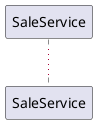

# Java / Spring Boot Language Profile

The `language_profile` for Java/Spring. Owns all Java/Spring-specific conventions, templates, and examples for the DisC methodology.

---

## Target Placement Declaration

In Java/Spring, a design file's `target_placement` is a fully-qualified package. Each design file declares it directly.

### In `.puml` files

A header comment on the line immediately after `@startuml`:



The package is the placement for every artifact derived from this diagram.

### In `.decision.md` files

A `package:` field in the YAML frontmatter:

```yaml
---
target: BulkDiscountCalculator.calculate
package: com.demo.sale
input:
  quantity: Integer
  lineSubtotal: BigDecimal
output: BigDecimal
---
```

The package is the placement for the leaf's interface, implementation, and test.

### Resolution

`{basePackage}` resolves per-file to the file's declared package. `{basePackagePath}` is `{basePackage}` with `.` replaced by `/` (e.g., `com.demo.sale` → `com/demo/sale`).

---

## Naming Conventions

By default, the participant name is the interface name. 
If the participant uses a colon (e.g., `PriorityOrderService: OrderService`), the left side is the implementation name and the right side is the interface name. 
If no implementation name is defined, use `Default` + interface name.

| Element | Convention | Example                                   |
|---|---|-------------------------------------------|
| Interface | PascalCase, from participant name (or right of `:`) | `OrderService` |
| Implementation class | Left of `:` if defined, otherwise `Default` + interface name | `PriorityOrderService` or `DefaultOrderService`|
| Test class | Implementation name + `Test` | `PriorityOrderServiceTest`                        |
| Test method | `should` + verb phrase describing interaction | `shouldSaveOrder`                         |
| Mock field (collaborator) | camelCase of interface name | `orderMapper`                             |
| Mock field (data) | Variable name from return label. Type from explicit `: Type` or PascalCase inference | `savedOrder : Order` → field: `Order savedOrder` |

The interface name will be referenced as "InterfaceName"
the implementation name will be referenced as "ImplementationName"
---

## Package Placement

| Suffix | Package | Example |
|---|---|---|
| `*Service` | `{basePackage}.service` | `OrderService.java` |
| `*Repository` | `{basePackage}.repository` | `OrderRepository.java` |
| `*Mapper` | `{basePackage}.mapper` | `OrderMapper.java` |
| `*Factory` | `{basePackage}.factory` | `OrderFactory.java` |
| `*Builder` | `{basePackage}.builder` | `SaleBuilder.java` |
| `*Controller` | `{basePackage}.controller` | `OrderController.java` |
| Entity/model types | `{basePackage}.entity` or `{basePackage}.model` | `Order.java` |
| `*Request`, `*Response`, `*DTO` | `{basePackage}.model` | `CreateOrderRequest.java` |
| Test classes | Same package as implementation, under `src/test/java` | `DefaultOrderServiceTest.java` |

If a suffix doesn't match any rule, use `{basePackage}.service` as the default.

---

## File Path Patterns

| Element | Path |
|---|---|
| Interface | `src/main/java/{basePackagePath}/[package]/[InterfaceName].java` |
| Implementation | `src/main/java/{basePackagePath}/[package]/[ImplementationName].java` |
| Test | `src/test/java/{basePackagePath}/[package]/[ImplementationName]Test.java` |
| Domain type | `src/main/java/{basePackagePath}/entity/[Type].java` |

---

## Domain Type Rule

Any type in an interface method signature that represents a domain concept is generated as an **interface**, not a class. This enforces Dependency Inversion.

**Exceptions** — these are NOT domain types; leave as-is, do not generate interfaces for them:

| Category | Examples |
|---|---|
| Primitives/wrappers | `UUID`, `String`, `Integer`, `Long`, `Boolean` |
| Standard generics | `Optional<T>`, `List<T>`, `Map<K,V>`, `Set<T>` |
| Framework types | Spring, JPA types |
| Boundary carriers | `*Request`, `*Response`, `*DTO` |

Primitives and final classes like `UUID`, `Integer`, `String` cannot be mocked. Use real values: `UUID.randomUUID()`, `(int)(Math.random() * 1000)`.

**Note:** if a domain type EXISTS as a class, do not convert to interface. Warn in report.

---

## Test Class Template

```java
package {basePackage}.service;

import org.junit.jupiter.api.BeforeEach;
import org.junit.jupiter.api.Nested;
import org.junit.jupiter.api.Test;
import org.mockito.Mock;
import org.mockito.junit.jupiter.MockitoSettings;
import org.mockito.quality.Strictness;

import static org.assertj.core.api.Assertions.assertThat;
import static org.mockito.ArgumentMatchers.any;
import static org.mockito.Mockito.verify;
import static org.mockito.Mockito.when;

@MockitoSettings(strictness = Strictness.LENIENT)
class [ImplementationName]Test {

    @Mock private [Collaborator1] [collaborator1];
    @Mock private [Collaborator2] [collaborator2];
    @Mock private [InputType] [input];
    @Mock private [ReturnType1] [returnValue1];
    private [FinalReturnType] result;
    [InterfaceName] [implementationName];

    @BeforeEach
    void setUp() {
        [implementationName] = new [ImplementationName]([collaborator1], [collaborator2]);
    }

    @Nested
    class When[MethodName] {
        @BeforeEach
        void setUp() {
            when([collaborator].method(any())).thenReturn([returnValue]);
            result = [implementationName].[methodName]([input]);
        }

        @Test void should[DescribeInteraction]() { verify([collaborator]).[method]([expectedArg]); }
        @Test void shouldReturn[ExpectedResult]() { assertThat(result).isEqualTo([expectedReturnMock]); }
    }
}
```

Mapping to SKILL.md concepts:
- `@Mock` collaborator field = `collaborator` mock
- `@Mock` data field = `data_mock`
- `@Nested` class = `test_group`
- `@BeforeEach` with `when().thenReturn()` = `stub` setup
- `verify()` call = `verify_test`
- `assertThat(result)` = `result_test`

---

## Implementation Template

```java
package {basePackage}.service;

import org.springframework.stereotype.Service;

@Service
public class [ImplementationName] implements [InterfaceName] {
    private final [Collaborator1] [collaborator1];
    private final [Collaborator2] [collaborator2];

    public [ImplementationName]([Collaborator1] [collaborator1], [Collaborator2] [collaborator2]) {
        this.[collaborator1] = [collaborator1];
        this.[collaborator2] = [collaborator2];
    }

    @Override
    public [ReturnType] [methodName]([InputType] [input]) {
        // One line per verify() test, in order
        [ReturnType1] [var1] = [collaborator1].method([input]);
        [ReturnType2] [var2] = [collaborator2].method([var1]);
        return [var2];
    }
}
```

### Implementation Conventions

- Use `@Service` annotation (or `@Component` for non-service classes)
- Constructor injection for all collaborators (no `@Autowired`)
- One method call per `verify()` test, maintaining the order from the test
- Variable names match the mock field names from the test
- Return type matches the `result` field type in the test

---

## Build Command

```
./gradlew test
```

---

## UPDATE Mode Rules

| File type | ADD | Do NOT touch |
|---|---|---|
| Interface | New method signatures (skip if present) | Existing signatures |
| Test | New `@Nested` class + new `@Mock` fields if not declared | Existing `@Nested`, `@Test`, `@Mock`, setup |
| Implementation | New method + new fields + new constructor params | Existing methods, logging, annotations |
| Domain type (EXISTS) | Nothing — skip | Everything |

---

## Decision Table (pure function `leaf_node`)

A pure-function leaf is tested either from a **skeleton** (no `decision_table_file` attached) or from **filled rows** (a `<Participant>.decision.md` exists in `design/` and pairs with this leaf).

### Skeleton mode (no `decision_table_file`)

```java
class [ImplementationName]Test {

    private [InterfaceName] [instance] = new [ImplementationName]();

    // TODO: Human must fill in the decision table.
    // DisC CANNOT dictate the implementation of pure functions.
    // Only the human-designed examples constrain the output.

    @Test void shouldHandleBaseCase() {
        assertThat([instance].[method]([baseInput]))
            .isEqualTo([expectedBaseOutput]); // <- Human fills this in
    }

    @Test void shouldHandleEdgeCase() {
        assertThat([instance].[method]([edgeInput]))
            .isEqualTo([expectedEdgeOutput]); // <- Human fills this in
    }
}
```

### Filled mode (`decision_table_file` attached)

Input file: `design/<Participant>.decision.md` with YAML frontmatter + markdown table.

```markdown
---
target: ProductMapper.toEntity
input:
  request.name: String
  request.price: BigDecimal
output: Product
---

| request.name | request.price | expected.name | expected.price |
|---|---|---|---|
| "Widget"     | 10.00         | "Widget"      | 10.00          |
| "  Item  "   | 5.00          | "Item"        | 5.00           |
| ""           | 10.00         | throws: IllegalArgumentException |  |
```

**Frontmatter fields:**
- `target: <Class>.<method>` — required. Names the participant and call_arrow in the UML this table specifies.
- `input:` — required. Map of column name → type for every input column.
- `output:` — required. Return type of the target method (or the object type when output columns are `expected.<field>`).
- `config:` — optional. Pins behaviour-changing choices the rows do not demonstrate. Keys are enumerated below; unknown keys cause Step 1 refusal.

**Recognized `config:` keys:**

| Key | Allowed values | Required when |
|---|---|---|
| `rounding` | `HALF_UP`, `HALF_EVEN`, `HALF_DOWN`, `CEILING`, `FLOOR` | Output type involves `BigDecimal` or floating-point arithmetic and rows do not uniquely demonstrate the mode. **`required_decision`.** |
| `scale` | non-negative integer | `rounding` is set or rows imply rounding occurs. **`required_decision` when rounding occurs**; otherwise the default is to preserve the input's scale. |
| `nullHandling` | `throw`, `passThrough`, `defaultValue` | Any input column is a nullable reference type and rows do not demonstrate the choice. **`required_decision`.** |
| `exceptionType` | fully-qualified class name (e.g. `java.lang.IllegalArgumentException`) | A row's output cell is `throws:` without a specific type, or validation behaviour is implied but no exception row exists. **`required_decision`.** |
| `locale` | BCP-47 tag (e.g. `en-US`) or `ROOT` | Optional. Default: `ROOT`. Override only when case-folding, collation, or formatting must follow a specific locale. |

Unknown `config:` keys cause Step 1 refusal — DisC will not silently ignore them.

**Recognized `optional_decision` entries:**

| Axis | Default value | Override mechanism |
|---|---|---|
| `locale` | `Locale.ROOT` | `config: locale:` |
| Ordering of unordered output | Preserve input order | None — inherent to language defaults |
| `scale` (without rounding) | Preserve input scale | `config: scale:` |
| Whitespace | Preserve unless a row demonstrates a transformation | None — change a row instead |

`config:` uses the YAML literal (e.g., `ROOT`); the implementation uses the Java constant (`Locale.ROOT`). Defaults are applied silently when rows and `config:` are silent; they are not reported per run.

**Row conventions:**
- String literals quoted: `"Widget"`. Whitespace inside the quotes is meaningful.
- Numeric literals unquoted: `10.00`, `-50`.
- Exception rows: output cell is `throws: <ExceptionType>` or `throws: <ExceptionType>: "<message>"`. Other `expected.*` cells are ignored.

**Generated test file:**

```java
@MockitoSettings(strictness = Strictness.LENIENT)
class DefaultProductMapperTest {

    private ProductMapper productMapper = new DefaultProductMapper();

    @Test
    void shouldMapWidget() {
        CreateProductRequest request = new CreateProductRequest("Widget", new BigDecimal("10.00"));
        Product result = productMapper.toEntity(request);
        assertThat(result.getName()).isEqualTo("Widget");
        assertThat(result.getPrice()).isEqualByComparingTo(new BigDecimal("10.00"));
    }

    @Test
    void shouldTrimItem() {
        CreateProductRequest request = new CreateProductRequest("  Item  ", new BigDecimal("5.00"));
        Product result = productMapper.toEntity(request);
        assertThat(result.getName()).isEqualTo("Item");
        assertThat(result.getPrice()).isEqualByComparingTo(new BigDecimal("5.00"));
    }

    @Test
    void shouldRejectEmptyName() {
        CreateProductRequest request = new CreateProductRequest("", new BigDecimal("10.00"));
        assertThatThrownBy(() -> productMapper.toEntity(request))
            .isInstanceOf(IllegalArgumentException.class);
    }
}
```

**Filled-mode rules:**
- One `@Test` per row. Test method names are humanised from row content.
- No `@Mock` on declared input types — construct real instances using declared types from `input:`.
- Primitives and final classes (`UUID`, `Integer`, `String`, `BigDecimal`) always use real values.
- Exception rows use `assertThatThrownBy`. When the row specifies a message, chain `.hasMessage(...)`.
- No TODO markers. Every row is concrete.
- Every `required_decision` (see the `config:` keys table above) MUST be either demonstrated by rows or pinned by `config:`. Otherwise Step 1 refuses.
- `optional_decision` behaviour is applied silently when rows and `config:` are silent. The full list and defaults are in the **Recognized `optional_decision` entries** table above.

---

## Walkthrough: Linear Flow

Full pipeline example for a simple linear sequence diagram.

**UML Input:**
```
@startuml
' @package com.example.product
ProductService -> ProductMapper: toEntity(createProductRequest)
ProductMapper --> ProductService: product
ProductService -> ProductRepository: save(product)
ProductRepository --> ProductService: savedProduct : Product
ProductService -> ProductMapper: toDTO(savedProduct)
ProductMapper --> ProductService: productDto
ProductService -> ProductResponseFactory: createSingleResponse(productDto)
ProductResponseFactory --> ProductService: singleProductResponse
@enduml
```

**Step 1:** 4 `call_arrow`s, 4 `return_arrow`s. All labeled, all supported. `target_placement` declared (`com.example.product`).

**Step 2:**
- `ProductService` → `component_under_test`
- `ProductMapper` → `leaf_node` (pure function — output depends only on inputs)
- `ProductRepository` → `leaf_node` (side effect — touches the database)
- `ProductResponseFactory` → `leaf_node` (factory — name ends in `Factory`; no standalone test)
- 4 `interaction`s, all with `return_arrow`s
- `data_pipe`s: `product` → `save` → `savedProduct` → `toDTO` → `productDto` → `createSingleResponse`

**Step 3:** Read placement (`com.example.product`). Derive paths under it. Glob. All NEW → CREATE.

**Step 4:** Apply transformation rules →

```java
@MockitoSettings(strictness = Strictness.LENIENT)
class DefaultProductServiceTest {

    @Mock private ProductRepository productRepository;
    @Mock private ProductMapper productMapper;
    @Mock private ProductResponseFactory responseFactory;

    @Mock private CreateProductRequest createProductRequest;
    @Mock private Product product;
    @Mock private Product savedProduct;
    @Mock private ProductDTO productDto;
    @Mock private SingleProductResponse singleProductResponse;

    private SingleProductResponse result;
    DefaultProductService defaultProductService;

    @BeforeEach
    void setUp() {
        defaultProductService = new DefaultProductService(
            productRepository, productMapper, responseFactory);
    }

    @Nested
    class WhenCreateProduct {
        @BeforeEach
        void setUp() {
            when(productMapper.toEntity(any())).thenReturn(product);
            when(productRepository.save(any())).thenReturn(savedProduct);
            when(productMapper.toDTO(any())).thenReturn(productDto);
            when(responseFactory.createSingleResponse(any())).thenReturn(singleProductResponse);
            result = defaultProductService.createProduct(createProductRequest);
        }

        @Test void shouldMapToEntity() { verify(productMapper).toEntity(createProductRequest); }
        @Test void shouldSaveProduct() { verify(productRepository).save(product); }
        @Test void shouldMapToDto() { verify(productMapper).toDTO(savedProduct); }
        @Test void shouldCreateResponse() { verify(responseFactory).createSingleResponse(productDto); }
        @Test void shouldReturnResponse() { assertThat(result).isEqualTo(singleProductResponse); }
    }
}
```

In addition, `ProductMapper` is a `pure function` leaf without a `decision_table_file` attached, so a `decision_table` skeleton is generated for it (see the Skeleton-mode template in the Decision Table section above). The human is expected to fill in the test cases.

**Step 5:** Arrow parity: 4 = 4. Data flow: pipes connect. File modes: all CREATE. Patterns: leaf nodes classified; `ProductMapper` skeleton marked TODO for human review.

**Step 6:** Read tests → derive implementation. Each `verify()` → one method call. Pipes flow through.

**Step 8 report:**
```
Arrows:          4 call_arrows parsed
Orchestrators:   1 (ProductService)
Leaf nodes:      3 total (1 pure function, 1 side effect, 1 factory)
Decision tables: 0 filled from decision_table_file, 1 skeleton for humans to fill
Tests:           4 verify_tests + 1 result_test = 5 total
Files:           CREATE: ProductService, ProductServiceTest, DefaultProductService, DefaultProductServiceTest, ProductMapperTest (skeleton), Product, ProductDTO, SingleProductResponse
```

---

## Example: Branching (Update or Create)

Demonstrates `branch_block` → separate `@Nested` classes per branch.

**UML Input:**
```
OrderService -> OrderRepository: findById(orderId)
OrderRepository --> OrderService: existingOrder
alt [existingOrder is present]
    OrderService -> OrderMapper: updateEntity(existingOrder, request)
    OrderMapper --> OrderService: updatedOrder
    OrderService -> OrderRepository: save(updatedOrder)
    OrderRepository --> OrderService: savedOrder
else [not found]
    OrderService -> OrderMapper: toEntity(request)
    OrderMapper --> OrderService: newOrder
    OrderService -> OrderRepository: save(newOrder)
    OrderRepository --> OrderService: savedOrder
end
```

**Generated Test:**
```java
@MockitoSettings(strictness = Strictness.LENIENT)
class DefaultOrderServiceTest {

    @Mock private OrderRepository orderRepository;
    @Mock private OrderMapper orderMapper;

    @Mock private OrderRequest request;
    @Mock private Order existingOrder;
    @Mock private Order updatedOrder;
    @Mock private Order newOrder;
    @Mock private Order savedOrder;
    private UUID orderId;
    private Order result;

    DefaultOrderService defaultOrderService;

    @BeforeEach
    void setUp() {
        orderId = UUID.randomUUID();
        defaultOrderService = new DefaultOrderService(orderRepository, orderMapper);
    }

    @Nested
    class WhenOrderExists {

        @BeforeEach
        void setUp() {
            when(orderRepository.findById(any())).thenReturn(Optional.of(existingOrder));
            when(orderMapper.updateEntity(any(), any())).thenReturn(updatedOrder);
            when(orderRepository.save(any())).thenReturn(savedOrder);
            result = defaultOrderService.createOrUpdate(orderId, request);
        }

        @Test void shouldFindById() { verify(orderRepository).findById(orderId); }
        @Test void shouldUpdateEntity() { verify(orderMapper).updateEntity(existingOrder, request); }
        @Test void shouldSaveUpdatedOrder() { verify(orderRepository).save(updatedOrder); }
        @Test void shouldReturnSavedOrder() { assertThat(result).isEqualTo(savedOrder); }
    }

    @Nested
    class WhenOrderNotFound {

        @BeforeEach
        void setUp() {
            when(orderRepository.findById(any())).thenReturn(Optional.empty());
            when(orderMapper.toEntity(any())).thenReturn(newOrder);
            when(orderRepository.save(any())).thenReturn(savedOrder);
            result = defaultOrderService.createOrUpdate(orderId, request);
        }

        @Test void shouldFindById() { verify(orderRepository).findById(orderId); }
        @Test void shouldMapToEntity() { verify(orderMapper).toEntity(request); }
        @Test void shouldSaveNewOrder() { verify(orderRepository).save(newOrder); }
        @Test void shouldReturnSavedOrder() { assertThat(result).isEqualTo(savedOrder); }
    }
}
```

**Generated Implementation:**
```java
@Service
public class DefaultOrderService implements OrderService {
    private final OrderRepository orderRepository;
    private final OrderMapper orderMapper;

    public DefaultOrderService(OrderRepository orderRepository, OrderMapper orderMapper) {
        this.orderRepository = orderRepository;
        this.orderMapper = orderMapper;
    }

    @Override
    public Order createOrUpdate(UUID orderId, OrderRequest request) {
        Optional<Order> existingOrder = orderRepository.findById(orderId);
        if (existingOrder.isPresent()) {
            Order updatedOrder = orderMapper.updateEntity(existingOrder.get(), request);
            return orderRepository.save(updatedOrder);
        } else {
            Order newOrder = orderMapper.toEntity(request);
            return orderRepository.save(newOrder);
        }
    }
}
```

Each branch: 3 `call_arrow`s = 3 `verify_test`s + 1 `result_test` = 4 tests per branch. Different `stub` setup drives different code paths.

---

## Example: Guard Clause (Validator with Exception)

Demonstrates `throw_arrow` → two `@Nested` classes governed by `throw_placement`.

**UML Input:**
```
ResourceUsageValidator -> ResourceUsageService: getResourceUsages(organizationId, resourceId, resourceType)
ResourceUsageService --> ResourceUsageValidator: resourceUsages
alt [resourceUsages is not empty]
    ResourceUsageValidator -> ResourceUsageValidator: <<throws>> ResourceInUseException
end
```

**Generated Test:**
```java
@MockitoSettings(strictness = Strictness.LENIENT)
class DefaultResourceUsageValidatorTest {

    @Mock private ResourceUsageService resourceUsageService;
    @Mock private ResourceUsageDetail resourceUsageDetails;

    private UUID organizationId;
    private String resourceType;
    private String resourceId;
    private DefaultResourceUsageValidator defaultResourceUsageValidator;

    @BeforeEach
    void setUp() {
        organizationId = UUID.randomUUID();
        resourceType = getRandomString();
        resourceId = getRandomString();
        defaultResourceUsageValidator = new DefaultResourceUsageValidator(resourceUsageService);
    }

    @Nested
    class NoUsage {
        @BeforeEach
        void setUp() {
            when(resourceUsageService.getResourceUsages(any(), any(), any()))
                .thenReturn(Collections.emptyList());
            // Happy path — method called in @BeforeEach
            defaultResourceUsageValidator.validate(organizationId, resourceId, resourceType);
        }

        @Test
        void shouldGetResourceUsage() {
            verify(resourceUsageService).getResourceUsages(organizationId, resourceId, resourceType);
        }
    }

    @Nested
    class Usage {
        @BeforeEach
        void setUp() {
            when(resourceUsageService.getResourceUsages(any(), any(), any()))
                .thenReturn(List.of(resourceUsageDetails));
            // Exception path — @BeforeEach only wires mocks, does NOT call method
        }

        @Test
        void shouldThrownException() {
            // Method called INSIDE assertThatThrownBy with .hasMessage()
            assertThatThrownBy(() -> defaultResourceUsageValidator
                .validate(organizationId, resourceId, resourceType))
                .isInstanceOf(ResourceInUseException.class)
                .hasMessage(RESOURCE_IN_USE_ERROR_MESSAGE.formatted(resourceType, resourceId));
        }
    }
}
```

**Three critical rules:**
1. **Method invocation placement:** Happy path calls method in `@BeforeEach`. Exception path calls it inside `assertThatThrownBy`.
2. **`.hasMessage()` verification:** Chain `.hasMessage(CONSTANT.formatted(...))` when the UML specifies a message template.
3. **`protected static final` constant:** Declare the error message as `protected static final String` in the implementation. The test imports it directly.

**Generated Implementation:**
```java
public class DefaultResourceUsageValidator implements ResourceUsageValidator {
    protected static final String RESOURCE_IN_USE_ERROR_MESSAGE = "Resource %s with id %s is currently in use";

    private final ResourceUsageService resourceUsageService;

    public DefaultResourceUsageValidator(ResourceUsageService resourceUsageService) {
        this.resourceUsageService = resourceUsageService;
    }

    @Override
    public void validate(UUID organizationId, String resourceId, String resourceType) {
        List<ResourceUsageDetail> resourceUsages =
            resourceUsageService.getResourceUsages(organizationId, resourceId, resourceType);
        if (!resourceUsages.isEmpty()) {
            throw new ResourceInUseException(
                RESOURCE_IN_USE_ERROR_MESSAGE.formatted(resourceType, resourceId));
        }
    }
}
```

1 `call_arrow` + 1 `throw_arrow` = 1 `verify_test` + 1 exception assertion = 2 total tests.

---

## Example: Loop + Builder (Iteration with Factory)

Demonstrates `loop_block` → single-element collections and real values for primitives.

**UML Input:**
```
SaleService -> ProductService: getProductByIds(productIds)
ProductService --> SaleService: products
SaleService -> ProductService: throwExceptionIfProductNoExist(productIds)
SaleService -> SaleBuilderFactory: create()
SaleBuilderFactory --> SaleService: saleBuilder
loop for each lineItem
    SaleService -> SaleBuilder: with(product, quantity)
end
SaleService -> SaleBuilder: build()
SaleBuilder --> SaleService: sale
SaleService -> SaleResponseFactory: create(sale)
SaleResponseFactory --> SaleService: saleResponse
```

**Key test patterns for loop:**
```java
// Primitives — real values, not mocks
private final UUID productId = UUID.randomUUID();
private final Integer quantity = (int) (Math.random() * 1000);

// List.of() with single element — iteration happens once
when(saleRequest.getLineItems()).thenReturn(List.of(saleLineItemRequest));
when(productService.getProductByIds(any())).thenReturn(List.of(product));

// verify() for the call inside the loop
@Test void shouldBuildWithProductAndQuantity() { verify(saleBuilder).with(product, quantity); }
```

**Rules for loops:**
- Mock inputs use `List.of()` with a single element so iteration executes once
- Primitives and final classes (`UUID`, `Integer`, `String`) use real values, not mocks
- Each `call_arrow` inside the `loop_block` still produces one `verify_test`
- In implementation, the `loop_block` becomes iteration (`.forEach()` or `.stream()`)

---

## Example: UML + Decision Table (Pure function leaf filled from `design/`)

Demonstrates the paired mode: a UML defines orchestration; a `decision_table_file` defines the `pure function` leaf's behaviour. DisC generates filled tests (not a skeleton) and derives implementation from the rows.

**UML Input** (`design/CreateProduct.puml`):
```
@startuml
' @package com.example.product
ProductService -> ProductMapper: toEntity(createProductRequest)
ProductMapper --> ProductService: product
ProductService -> ProductRepository: save(product)
ProductRepository --> ProductService: savedProduct : Product
@enduml
```

**Decision Table Input** (`design/ProductMapper.decision.md`):
```markdown
---
target: ProductMapper.toEntity
package: com.example.product
input:
  request.name: String
  request.price: BigDecimal
output: Product
config:
  nullHandling: throw
---

| request.name | request.price | expected.name | expected.price |
|---|---|---|---|
| "Widget"     | 10.00         | "Widget"      | 10.00          |
| "  Item  "   | 5.00          | "Item"        | 5.00           |
| ""           | 10.00         | throws: IllegalArgumentException |  |
```

**Step 1:** Validate both inputs. UML has 2 `call_arrow`s. Decision table has well-formed frontmatter, 3 rows.

**Step 2:** Classify.
- `ProductService` → `component_under_test`
- `ProductMapper` → `leaf_node` (pure function)
- `ProductRepository` → `leaf_node` (side effect)
- Pair `ProductMapper.decision.md` with `ProductMapper.toEntity` → mark the leaf **filled**.

**Step 3:** Detect Java/Spring profile. Read placement (`com.example.product` on both files). Derive paths. Glob. Both NEW → CREATE.

**Step 4:** Generate.

Orchestration test for `ProductService` — standard mockist style from UML (one `verify_test` per `call_arrow`).

Filled leaf test for `ProductMapper`:

```java
class DefaultProductMapperTest {

    private ProductMapper productMapper = new DefaultProductMapper();

    @Test
    void shouldMapWidget() {
        CreateProductRequest request = new CreateProductRequest("Widget", new BigDecimal("10.00"));
        Product result = productMapper.toEntity(request);
        assertThat(result.getName()).isEqualTo("Widget");
        assertThat(result.getPrice()).isEqualByComparingTo(new BigDecimal("10.00"));
    }

    @Test
    void shouldTrimItem() {
        CreateProductRequest request = new CreateProductRequest("  Item  ", new BigDecimal("5.00"));
        Product result = productMapper.toEntity(request);
        assertThat(result.getName()).isEqualTo("Item");
        assertThat(result.getPrice()).isEqualByComparingTo(new BigDecimal("5.00"));
    }

    @Test
    void shouldRejectEmptyName() {
        CreateProductRequest request = new CreateProductRequest("", new BigDecimal("10.00"));
        assertThatThrownBy(() -> productMapper.toEntity(request))
            .isInstanceOf(IllegalArgumentException.class);
    }
}
```

**Step 5:** Quality Gate. `required_decision` check: `nullHandling` is pinned by `config:` to `throw`; `exceptionType` is named in the exception row (`IllegalArgumentException`); `rounding` not relevant (no decimal arithmetic); `scale` not relevant. All `required_decision` entries pinned or irrelevant. Pass.

**Step 6:** Implement. Reading the filled tests and the `config:` block:
- `config: nullHandling: throw` requires a null-check before trimming.
- Row 1 requires field copy.
- Row 2 requires `.trim()` on the name.
- Row 3 requires rejection of empty name after trimming.

No `required_decision` was unspecified; behaviour is fully determined by rows + `config:`.

```java
@Component
public class DefaultProductMapper implements ProductMapper {

    @Override
    public Product toEntity(CreateProductRequest request) {
        if (request.getName() == null) {
            throw new IllegalArgumentException("Product name must not be null");
        }
        String name = request.getName().trim();
        if (name.isEmpty()) {
            throw new IllegalArgumentException("Product name must not be empty");
        }
        Product product = new Product();
        product.setName(name);
        product.setPrice(request.getPrice());
        return product;
    }
}
```

**Step 8 report:**
```
Arrows:          2 call_arrows parsed
Orchestrators:   1 (ProductService)
Leaf nodes:      2 total (1 pure function, 1 side effect, 0 factory)
Decision tables: 1 filled from decision_table_file, 0 skeletons
Tests:           2 verify_tests + 1 result_test + 3 filled leaf tests = 6 total
```

3 `call_arrow`s worth + 3 filled rows = 6 tests total across both files.